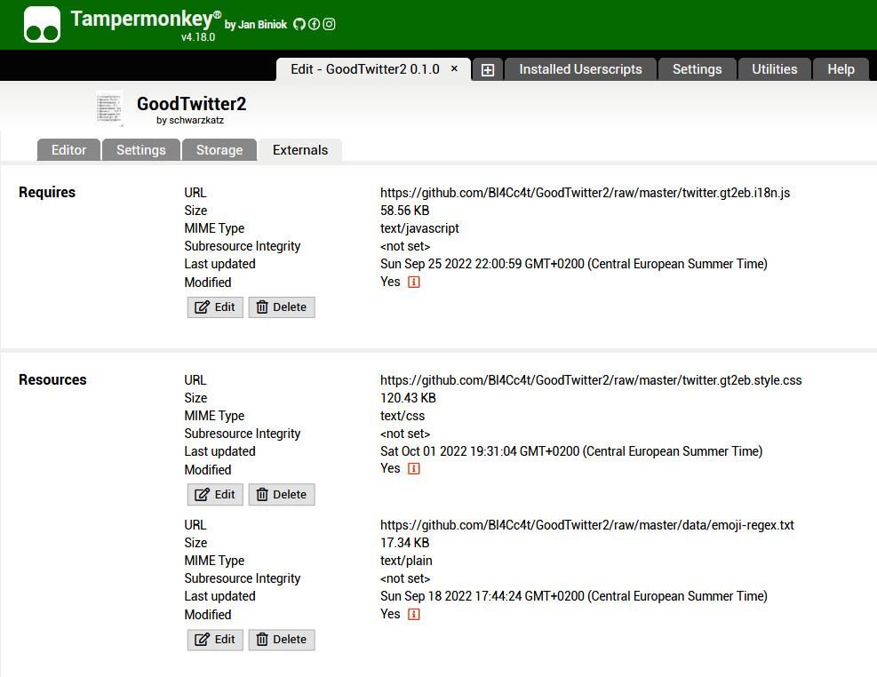

# Building
You can easily build the userscript yourself if you want!


## Requirements
- [Node.js](https://nodejs.org) (preferably v16+)

I like to use `yarn` more often these days.
It can easily be enabled via the `corepack enable` command.

`npm` should also work just fine.

## Steps to building
- Clone the Repo
  ```sh
  git clone https://github.com/Bl4Cc4t/GoodTwitter2
  ```

- Change the directory to the repo folder
  ```sh
  cd GoodTwitter2
  ```

- Install all the packages
  ```sh
  yarn install
  ```

- Build the userscript!
  ```sh
  yarn build
  ```

This should create 3 files in the `dist` directory.

For developing, the command `yarn build:js --watch` is very helpful.

## Output files

### `goodtwitter2.user.js`
This is the main userscript. It contains all the logic to change the site!

### `goodtwitter2.style.css`
This is the stylesheet for GoodTwitter2. Here are all custom styling rules defined.

### `goodtwitter2.i18n.js`
This is the internationalization file which contains localized versions of the strings used throughout the custom interfaces (mainly the GT2 settings page).

## Installation
Just add the script manually to your userscript manager.

In order to use a modified stylesheet & i18n file, you need to manually change the content of the external files loaded by the script manager.

Currently, this can only be done with Tampermonkey.

### Edit resources with Tampermonkey
- Navigate to the userscript.
- Change to the "Externals" tab.
- Click on "Edit" for the stylesheet and paste the content of the .css file.
- Repeat the previous step for the i18n file.



This only needs to be done if the contents of the files change, of course.
