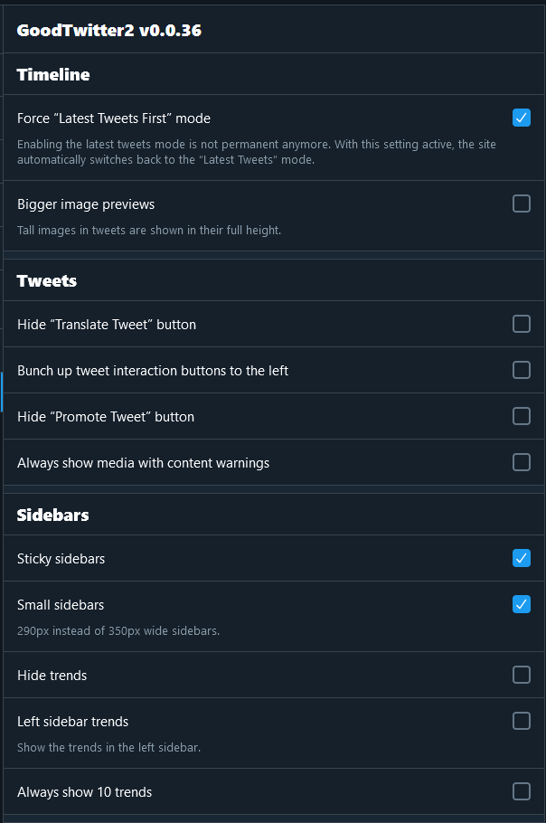

<div align="center">
  <h1>GoodTwitter 2 - Electric Boogaloo</h1>

  A try to make Twitter look good again.

  [Changelog](https://github.com/Bl4Cc4t/GoodTwitter2/blob/master/doc/changelog.md)

</div>

## Content
- [Background](#background)
- [Features](#features)
- [Installation](#installation)
- [Helping](#helping)
- [Translations](#translations)
- [Similar projects](#similar-projects)
- [Credits](#credits)
- [Previews](#previews)


## Background
Twitter disabled its old 2014 layout on June 1st 2020 completely. This caused the popular extension [GoodTwitter](https://github.com/ZusorCode/GoodTwitter) [to not work anymore](https://twitter.com/ZusorOW/status/1258885451055800320). But since I like the older layout better, I decided to create this script to recreate the legacy look in a way.


## Features
- Legacy Navbar is back!
  
- Legacy Profile Layout Option!
- Your profile appears on the left side for most pages
- All display settings are supported!
  - The default and dim theme use the color palette from legacy twitter
- Added toggle for nightmode when not logged in
- Translate tweets directly in your timeline!
- Various other custom settings, take a look at the [previews](#previews)

### Disclaimers
- Please keep in mind that a few things break from time to time so creating pull requests and/or issues is appreciated.
- This is by no means a full recreation of the old design, it is more like a hybrid between the two.


## Installation
To use this script, you need a userscript manager.

- Install [Tampermonkey](https://www.tampermonkey.net/) or [Violentmonkey](https://violentmonkey.github.io/get-it/) (Greasemonkey is not supported at the moment)
  - Violentmonkey may work better with very old Firefox versions.
- Then, click on [this link](https://github.com/Bl4Cc4t/GoodTwitter2/raw/master/twitter.gt2eb.user.js) and a new tab should open, prompting you with an installation screen.
- Hit install and you should be good to go!
- [Firefox only] You do not need to disable CSP anymore. If you disabled it previously, see [this guide](https://github.com/Bl4Cc4t/GoodTwitter2/blob/master/doc/firefox-csp.md) on how to enable it again.

**Do not use this script together with the GoodTwitter extension. Disable it first!**

### Building
If you want to build the script yourself, take a look at [building.md](doc/building.md)


## Helping
If you want to help with the translations, check out [Adding translations](#adding-translations).

If you want to help with coding, you can take a look at the issue tracker. There are a lot of things that do not work correctly and I certainly could use some help with that :)


## Translations
Thanks to these awesome people, there are translations available for the following languages:
- Bulgarian (added by [@EdinUser](https://github.com/EdinUser))
- Simplified Chinese (added by [@Hewasshushed](https://github.com/Hewasshushed))
- Traditional Chinese (added by [@roy4801](https://github.com/roy4801))
- Dutch (added by [@gvmelle](https://github.com/gvmelle))
- French (added by [@Aridow](https://github.com/Aridow))
- Indonesian (added by [@NekoSam395](https://github.com/NekoSam395))
- Japanese (added by [@Gizel-jiz](https://github.com/Gizel-jiz))
- Korean (added by [@Lastorder-DC](https://github.com/Lastorder-DC))
- Polish (added by [@mkljczk](https://github.com/mkljczk))
- Portuguese (added by [@fr0r](https://github.com/fr0r))
- Romanian (added by [@Andy9001](https://github.com/Andy9001))
- Russian (added by [@BrandtnerKPW](https://github.com/BrandtnerKPW))
- Spanish (added by [@granmacco](https://github.com/granmacco))
- Swedish (added by [@krokerik](https://github.com/krokerik))
- Turkish (added by [@seaque](https://github.com/seaque))
- Ukrainian (added by [@megamanyoutuber](https://github.com/megamanyoutuber))
- Vietnamese (added by [@touanu](https://github.com/touanu))
- English and German are natively supported.


### Adding translations
If your language is not yet supported, you can help by adding it!
Open the following box to learn more.

<details>
  <summary>Adding an UI Translation</summary>

  - Switch to the dev branch.
  - Go to the i18n folder.
  - If a translation does not yet exist for your language:
    - Fork the repo
    - Duplicate the `en.yml` file and change the file name accordingly (i.e. `ja.yml` or `nl.yml`).
      - You can get the language id by pressing <kbd>Ctrl</kbd>+<kbd>U</kbd> on the twitter page and looking at the second line:


    - Then, translate all strings and create a pull request.
      - For all the strings in the first paragraph: Please use the official translations on twitter if you can.
    - You can also of course search for potential spelling mistakes or the likes and correct them for existing translations!
    - New strings will be added sometimes (e.g. for new settings). They will end with a `TODO` comment so you can spot them easier!

  If you don't know how to use git, you can also create an new issue with your translation.

  If you do so, please make sure to wrap the content of your file in backticks, like this:
  ````
  ```content```
  ````
</details>


## Similar projects
- [userscripts-public](https://github.com/Bl4Cc4t/userscripts-public) (other very small userscripts)


## Credits
This project uses the following libraries:
- [pickr](https://github.com/Simonwep/pickr) to select colors
- [emoji-regex](https://github.com/mathiasbynens/emoji-regex) (modified es2015/index.js from v9.2.2) to display the twitter emojis at various places
- [jQuery](https://jquery.com)
- [waitForKeyElements.js](https://gist.github.com/BrockA/2625891)
- some polyfills from MDN


## Previews
[](https://raw.githubusercontent.com/Bl4Cc4t/GoodTwitter2/master/doc/img/preview/profile-1.png)
[](https://raw.githubusercontent.com/Bl4Cc4t/GoodTwitter2/master/doc/img/preview/profile-2.png)
[](https://raw.githubusercontent.com/Bl4Cc4t/GoodTwitter2/master/doc/img/preview/tweet.png)
[](https://raw.githubusercontent.com/Bl4Cc4t/GoodTwitter2/master/doc/img/preview/home-1.png)
[](https://raw.githubusercontent.com/Bl4Cc4t/GoodTwitter2/master/doc/img/preview/home-2.png)


### Settings
Page 1 | Page 2
-|-
[](https://raw.githubusercontent.com/Bl4Cc4t/GoodTwitter2/master/doc/img/preview/settings-1.png) | [](https://raw.githubusercontent.com/Bl4Cc4t/GoodTwitter2/master/doc/img/preview/settings-2.png)
